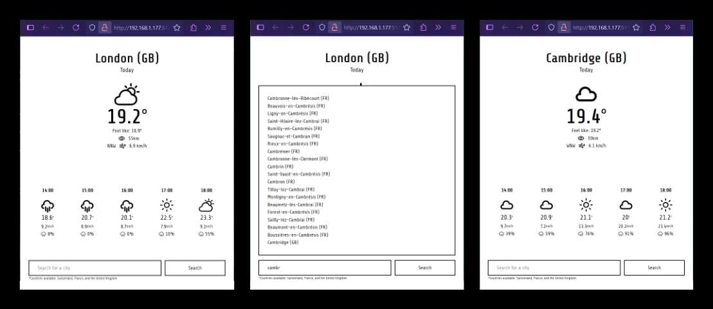

# Weather Forecast App

A lightweight weather forecast application built with React & Laravel, pulling real-time data from public APIs.

## Project Status

**Phase One complete — core features are live and functional.**  
The project is now stable and working end-to-end, with initial goals successfully implemented.

Upcoming upgrades and new enhancements (like multi-country support and rain graphs) are planned for future releases. Stay tuned!

Feel free to fork, explore, or contribute — your insights are always welcome.

## Live View

**URL:** [weather.aurelienj.ch](https://w8ther.com)

## Weather Pictures — A Simple Weather Dashboard

A responsive weather application built with React (Vite), Tailwind CSS, and Laravel.  
Currently supports forecast data for Switzerland, France, and the UK — with upcoming features like rain graphs and multi-country support.



## Development Steps

## Completed Features

- [x] Project initialized
- [x] React frontend scaffolded with Vite
- [x] Tailwind CSS integrated
- [x] Laravel backend configured
- [x] City data parsed from GeoNames
- [x] Geolocation feature implemented
- [x] Core UI functional and app working end-to-end
- [x] Format and normalize Weather API responses
- [x] Create display components for forecast data
- [x] Support French and English using i18Next

## Next Steps / Ideas

- [ ] Integrate precipitation for next days (rain data visualization)
- [ ] Add support for more countries (currently limited to Switzerland, France, and the UK)
- [ ] Add unit toggle (metric/imperial)
- [ ] Save user preferences (localStorage or cookies)
- [ ] ...

## Data Sources

### License

This project is licensed under the [MIT License](./LICENSE.md).  
Feel free to use, modify, and distribute it with proper attribution.
@aurelien404.

### Tools

- **Weather API:**  
  [Open-Meteo](https://open-meteo.com/en/docs) — Free weather data with hourly/daily forecasts.

- **City Database:**  
  [GeoNames Dump](https://download.geonames.org/export/dump/) — City listings with latitude/longitude data.

- **Weather Icons:**  
  [React Icons](https://react-icons.github.io/react-icons/) — Beautiful icon sets for weather conditions.

### Docs

- **Open-Meteo docs:**  
  [0penmete0.md](https://github.com/aurelien404/Forecast-weather/blob/main/Docs/0penmete0.md) — Personnal docs about Open Meteo Api.

## Installation

# Clone the project

```bash
git clone https://github.com/your-username/laravel-weather-app.git
```
